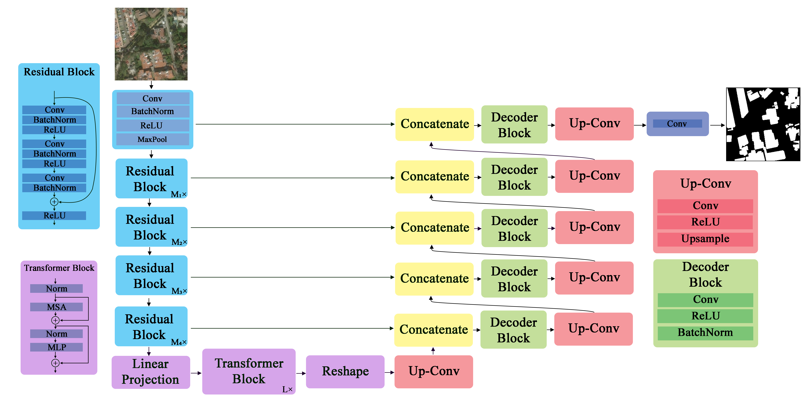

# 2-step Damage Assessment
Damage assessment divided by image segmentation step and classification step. Image segmentation uses pre-disaster image from the dataset while classification uses post-disaster image.

The dataset used to test the model is [xBD Dataset](https://xview2.org/dataset).

# Image Segmentation Model
The model architecture is based on [TransUNet](https://arxiv.org/abs/2102.04306).

